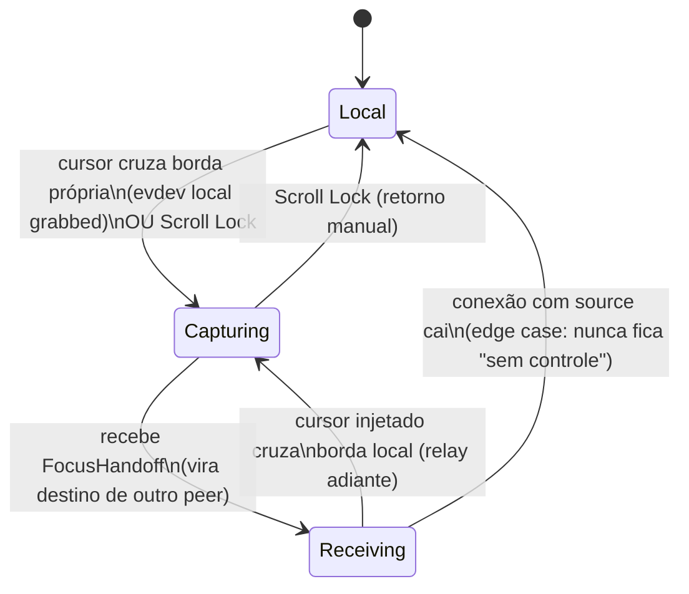
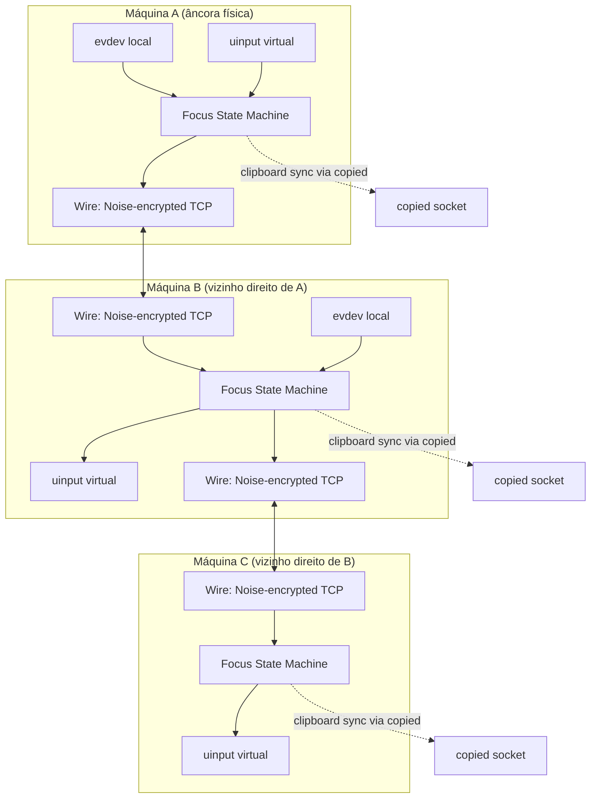

# kvm-share — Malha Criptografada com Borda de Tela e Clipboard Sync — Design

**Spec**: `.specs/features/kvm-mesh-crypto-clipboard/spec.md`
**Status**: Draft

---

## Decisão arquitetural central: modelo de relay em cadeia (sem servidor central)

A interview travou duas restrições que juntas forçam um modelo específico: **(a) malha direta, sem hub/coordenador central** e **(b) `peers.toml` declara só a direção dos vizinhos imediatos** (não um mapa global de telas). Diferente do Barrier/Synergy clássico (um servidor central sempre sabe a posição do cursor e decide quem está ativo), aqui **não existe autoridade central** — então o roteamento de foco tem que ser um **relay em cadeia**: cada máquina só sabe do vizinho imediato em cada direção, e repassa adiante quando o cursor cruza sua própria borda.

Isso significa: o mouse/teclado físico fica sempre fisicamente plugado numa única máquina (chamada aqui de **âncora**), mas a máquina que está **capturando e encaminhando** (papel `Capturing`) muda dinamicamente conforme o "cursor virtual" atravessa cada borda — cada máquina intermediária vira ao mesmo tempo destino (injeta localmente) e nova fonte (encaminha pro próximo vizinho), sem que a âncora original precise saber da existência da máquina N+2.

**Isso é uma decisão de design, não estava explícito na interview — sinalizando aqui pra confirmação antes de seguir pra `/taskify`.**



---

## Architecture Overview

Um único binário/daemon `kvm-share` roda em cada máquina. Cada instância:

1. Abre os dispositivos `evdev` locais e cria seu dispositivo virtual `uinput` no boot (sempre pronta pra qualquer papel).
2. Mantém conexões TCP persistentes só com os peers listados em `peers.toml` (vizinhos imediatos).
3. Autentica cada conexão via Noise Protocol (`Noise_XXpsk3`) com a PSK daquele peer.
4. Roteia eventos de input/clipboard através de uma máquina de estados de foco (`Local` / `Capturing` / `Receiving`).



---

## Code Reuse Analysis

### Existing Components to Leverage

| Component | Location | How to Use |
| --- | --- | --- |
| `write_event`/`read_event` (frame de 8 bytes) | `src/lib.rs` | Vira o payload interno do `WireMessage::InputEvent` — mesmo formato binário, agora envelopado e cifrado |
| Loop de captura + grab/ungrab por dispositivo | `src/bin/capture.rs::run_device_loop` | Extraído pra `kvm_share::devices::capture`, parametrizado pelo estado de foco em vez do `AtomicBool` global fixo |
| `build_virtual_device` | `src/bin/inject.rs` | Extraído pra `kvm_share::devices::inject`, instanciado uma vez no boot independente do papel |
| `TOGGLE_KEY` / lógica de alternância manual | `src/lib.rs`, `src/bin/capture.rs` | Mantido como transição manual na máquina de estados de foco (convive com borda de tela) |
| Reconexão sob demanda (`ensure_connected`) | `src/bin/capture.rs` | Generalizado pra qualquer peer em `kvm_share::wire::ConnectionPool` |

### Integration Points

| System | Integration Method |
| --- | --- |
| `copied` (daemon externo) | `copied-core` como dependência git fixada em rev, socket Unix `$XDG_RUNTIME_DIR/copied.sock`, `Command::GetLatestText` (novo, patch necessário no `copied`) + `Command::CopyText`/`CopyImage` |
| `snow` (Noise Protocol) | Nova dependência de crate — handshake e transporte cifrado |

---

## Components

### `kvm_share::noise` — sessão Noise autenticada

- **Purpose**: Estabelecer e manter uma sessão `Noise_XXpsk3` cifrada sobre um `TcpStream`, dos dois lados (iniciador/respondedor).
- **Location**: `src/noise.rs`
- **Interfaces**:
  - `fn handshake_as_initiator(stream: TcpStream, local_name: &str, psk: &[u8; 32]) -> Result<EncryptedChannel>`
  - `fn handshake_as_responder(stream: TcpStream, resolve_psk: impl Fn(&str) -> Option<[u8; 32]>) -> Result<EncryptedChannel>`
  - `EncryptedChannel::send(&mut self, plaintext: &[u8]) -> Result<()>` / `EncryptedChannel::recv(&mut self) -> Result<Option<Vec<u8>>>`
- **Dependencies**: `snow`
- **Reuses**: nada do código atual (peça nova)

### `kvm_share::wire` — protocolo de aplicação sobre o canal cifrado

- **Purpose**: Serializar/desserializar `WireMessage` (evento de input, clipboard, controle de foco) em frames dentro do `EncryptedChannel`.
- **Location**: `src/wire.rs`
- **Interfaces**:
  - `enum WireMessage { InputEvent(InputEvent), ClipboardText(String), ClipboardImage { mime: String, bytes: Vec<u8> }, FocusHandoff, Heartbeat }`
  - `fn write_message(channel: &mut EncryptedChannel, msg: &WireMessage) -> Result<()>`
  - `fn read_message(channel: &mut EncryptedChannel) -> Result<Option<WireMessage>>`
- **Dependencies**: `kvm_share::noise`
- **Reuses**: framing de 8 bytes de `src/lib.rs` como sub-encoding de `InputEvent`

### `kvm_share::config` — configuração estática

- **Purpose**: Ler `~/.config/kvm-share/peers.toml` e resolver os arquivos de PSK por peer.
- **Location**: `src/config.rs`
- **Interfaces**:
  - `struct LocalConfig { name: String, width: u32, height: u32 }`
  - `struct PeerConfig { name: String, addr: SocketAddr, psk_path: PathBuf, direction: Direction }`
  - `enum Direction { Left, Right, Up, Down }`
  - `fn load() -> Result<(LocalConfig, Vec<PeerConfig>)>`
- **Dependencies**: `serde`, `toml`
- **Reuses**: nada existente

### `kvm_share::devices` — captura e injeção

- **Purpose**: Abstrair abertura/grab/ungrab de `evdev` e emissão em `uinput`, reutilizando a lógica original.
- **Location**: `src/devices.rs`
- **Interfaces**:
  - `fn open_capture_devices(paths: &[String]) -> Result<Vec<Device>>`
  - `fn build_virtual_device() -> Result<VirtualDevice>` (movido de `inject.rs`, inalterado)
  - `fn grab(&mut Device)` / `fn ungrab(&mut Device)`
- **Dependencies**: `evdev`
- **Reuses**: `src/bin/capture.rs::run_device_loop` e `src/bin/inject.rs::build_virtual_device` quase inalterados

### `kvm_share::cursor` — rastreamento de borda por deltas

- **Purpose**: Acumular deltas de `REL_X`/`REL_Y` contra a resolução local e decidir quando uma borda configurada foi cruzada.
- **Location**: `src/cursor.rs`
- **Interfaces**:
  - `struct CursorTracker { x: i64, y: i64, width: u32, height: u32 }`
  - `fn accumulate(&mut self, dx: i32, dy: i32) -> Option<Direction>` — retorna a borda cruzada, se houver, e reresseta a posição pro lado oposto (entrada na próxima tela)
- **Dependencies**: nenhuma externa
- **Reuses**: nenhum

### `kvm_share::focus` — máquina de estados

- **Purpose**: Orquestrar a transição `Local` / `Capturing(peer)` / `Receiving(peer)`, decidindo quando grab/ungrab dispositivos locais, quando encaminhar e quando repassar adiante (relay).
- **Location**: `src/focus.rs`
- **Interfaces**:
  - `enum FocusState { Local, Capturing { target: PeerId }, Receiving { source: PeerId } }`
  - `fn on_input_event(&mut self, ev: InputEvent)` — despacha pro dispositivo local ou encaminha, conforme o estado
  - `fn on_wire_message(&mut self, from: PeerId, msg: WireMessage)` — trata `FocusHandoff` recebido, injeta eventos recebidos, dispara relay adiante se o cursor injetado cruzar a próxima borda
  - `fn on_toggle_key()` — transição manual (Scroll Lock)
- **Dependencies**: `kvm_share::{devices, cursor, wire, clipboard}`
- **Reuses**: lógica de alternância de `src/bin/capture.rs::run_device_loop`

### `kvm_share::clipboard` — ponte com `copied`

- **Purpose**: Ler/escrever clipboard local via o socket do `copied`, quando disponível.
- **Location**: `src/clipboard.rs`
- **Interfaces**:
  - `fn is_available() -> bool` (checa existência do socket)
  - `fn read_latest() -> Result<Option<ClipboardContent>>` (usa `Command::GetLatestText` / equivalente de imagem)
  - `fn write(content: &ClipboardContent) -> Result<()>` (usa `Command::CopyText`/`CopyImage`)
- **Dependencies**: `copied-core` (git dep, rev fixada)
- **Reuses**: tipos `Command`/`Response` do `copied-core`

### `src/bin/kvm-share.rs` — CLI

- **Purpose**: Ponto de entrada único com subcomandos.
- **Location**: `src/bin/kvm-share.rs`
- **Interfaces**:
  - `kvm-share run` — sobe o daemon (comportamento default se nenhum subcomando for passado)
  - `kvm-share keygen <peer-name> <ip>` — gera PSK, salva local em `~/.config/kvm-share/peers/<peer-name>.psk`, tenta `scp` pro destino; em falha, instrui cópia manual
- **Dependencies**: todos os módulos acima

---

## Data Models

### `peers.toml`

```toml
[local]
name = "desktop"
width = 2560
height = 1440
listen = "0.0.0.0:7532"

[[peer]]
name = "laptop"
addr = "192.168.1.50:7532"
psk_path = "~/.config/kvm-share/peers/laptop.psk"
direction = "right"
```

### `WireMessage` (após o preâmbulo de identidade e handshake Noise)

```rust
enum WireMessage {
    InputEvent(InputEvent),                          // tag 0x01 — reusa frame de 8 bytes existente
    ClipboardText(String),                            // tag 0x02
    ClipboardImage { mime: String, bytes: Vec<u8> },  // tag 0x03
    FocusHandoff,                                     // tag 0x04
    Heartbeat,                                        // tag 0x05
}
```

**Relationships**: `WireMessage` viaja sempre dentro de um `EncryptedChannel` (nunca em texto claro); `PeerConfig.direction` alimenta `CursorTracker`/`FocusState` pra saber pra onde repassar.

---

## Error Handling Strategy

| Error Scenario | Handling | User Impact |
| --- | --- | --- |
| Conexão de rede cai durante `Capturing`/`Receiving` | Volta pro estado `Local` na(s) máquina(s) afetada(s); dispositivos locais nunca ficam grabbed sem destino válido | Usuário recupera controle local automaticamente, sem travar |
| Handshake falha (PSK errada ou peer desconhecido no preâmbulo de identidade) | Conexão encerrada imediatamente, log do motivo, sem retry automático até config mudar | Peer não autorizado nunca troca eventos |
| Duas bordas cruzadas simultaneamente (topologia cíclica) | Prioridade determinística: nome do peer alvo menor (ordem lexicográfica) vence a corrida | Comportamento previsível, nunca dois `Capturing` simultâneos pro mesmo par |
| `peers.toml` malformado / PSK referenciada não existe | Falha no boot com mensagem clara, processo não sobe parcialmente | Usuário corrige config antes de qualquer conexão ser tentada |
| Clipboard maior que limite configurado | Sync pulado com log, troca de foco prossegue normalmente | Clipboard não sincroniza dessa vez, mas KVM não trava |
| `scp` do `keygen` falha | Mostra path do arquivo de PSK gerado, instrui cópia manual | Pareamento continua possível sem SSH |
| `copied` ausente/socket não existe | `clipboard::is_available()` retorna falso, sync pulado silenciosamente (log info) | Clipboard sync desligado, KVM funciona normalmente |

---

## Tech Decisions (only non-obvious ones)

| Decision | Choice | Rationale |
| --- | --- | --- |
| Padrão Noise exato | `Noise_XXpsk3_25519_ChaChaPoly_BLAKE2s` (via `snow`) | Confirmado na doc oficial do `snow`: o modificador `psk3` precisa estar no nome do padrão, mistura a PSK após a 3ª mensagem do handshake `XX` |
| Chave estática por processo | Gerada efêmera a cada boot do daemon (`Builder::generate_keypair()`), não persistida | A autenticação real vem da PSK, não da chave estática do Noise — evita gerenciar mais um par de chaves |
| Seleção de PSK pelo respondedor | Preâmbulo em texto claro antes do handshake: `[u8 len][nome do peer]`, respondedor busca a PSK correspondente em `peers.toml` | Necessário pra escutar N peers na mesma porta — o nome não é segredo (a autenticação real é a PSK no handshake), então revelar o nome não compromete segurança |
| Modelo de foco | Relay em cadeia (`Local`/`Capturing`/`Receiving`), sem servidor central | Única forma de reconciliar "malha direta sem hub" com "config só de vizinhos imediatos" (ver seção de decisão arquitetural acima) |
| Chunking de payload grande (imagem) | `EncryptedChannel::send` fragmenta automaticamente em blocos ≤ 65519 bytes (limite do Noise transport message) com length-prefix de 4 bytes por frame de aplicação | Necessário pra clipboard de imagem passar pelo mesmo canal cifrado dos eventos de input |
| Config de peers | `toml` + `serde` | Formato legível/editável à mão, e `serde` já é dependência transitiva via `copied-core` |
| Dependência do `copied` | `copied-core` via git dependency fixada em rev (`Cargo.toml`: `{ git = "...", rev = "..." }`) | Decidido na interview — mantém os dois projetos independentes com checagem de protocolo em compile-time |
| Novo command no `copied` | `Command::GetLatestText` (texto) + variante equivalente pra imagem (ex: `Command::GetLatestImageBytes`) — a implementar no repo do `copied`, fora deste repositório | `List` hoje só devolve preview truncado (200 chars); necessário pra clipboard sync completo |

---

## Open Items para Confirmação

1. **Modelo de relay em cadeia** — não estava explícito na interview, é a resolução técnica de duas decisões que juntas exigiam esse desenho. Confirmar que faz sentido antes de ir pro `/taskify`.
2. **CLI do `keygen`** (`kvm-share keygen <peer-name> <ip>`) exige rodar duas vezes (uma em cada máquina, com o nome do peer visto de cada lado) pra completar o pareamento bidirecional — não foi detalhado na interview, é uma escolha de design.
3. Patch no `copied` (`GetLatestText`) é trabalho em outro repositório — fica fora do `tasks.md` deste projeto, mas é um bloqueador de fato pra história de clipboard sync funcionar de ponta a ponta.
