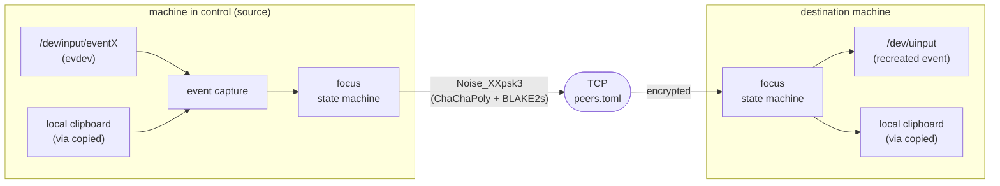
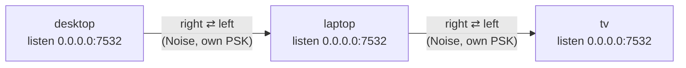

<p align="center">
  <a href="README.md">🇧🇷 Português</a> ·
  <a href="README.en.md">🇺🇸 English</a>
</p>

# kvmc-share

Mouse/keyboard/clipboard sharing across a mesh of Linux machines, built
specifically because COSMIC (Pop!_OS's compositor) still doesn't implement
the Wayland `org.freedesktop.portal.InputCapture` portal — which is why
Barrier, Input Leap, and Deskflow don't work on it (see issues
[pop-os/xdg-desktop-portal-cosmic#217](https://github.com/pop-os/xdg-desktop-portal-cosmic/issues/217)
and [pop-os/cosmic-comp#980](https://github.com/pop-os/cosmic-comp/issues/980)).

## How it works

Instead of depending on any Wayland protocol (portal, wlroots layer-shell,
etc.), this project operates one layer below, straight against the kernel:
it reads raw events from `/dev/input/eventX` via `evdev` on the source
machine and recreates them via `/dev/uinput` on the destination machine.
This works independently of the compositor.

A single binary, `kvmc-share`, runs on every machine in the mesh. Each
instance:

1. Opens its local devices and creates its own virtual `uinput` device at
   boot — any machine can become a source or destination of control at any
   time.
2. Keeps a persistent, authenticated TCP connection (Noise Protocol) with
   each peer declared in `peers.toml` (only immediate neighbors — no need
   for a global screen map).
3. Routes input/clipboard events through a focus state machine: when the
   cursor crosses the configured edge (or you press **Scroll Lock**),
   capture is handed off to the neighbor on that side; if the injected
   cursor crosses another edge on that machine, control is handed off
   again — a chained relay, with no central server.

There's no hub/coordinator: each machine only knows its immediate neighbor
in each direction (`left`/`right`/`up`/`down`).

### Data flow inside a single machine



### Mesh topology (3-machine example)

Each machine only knows its immediate neighbor — no central server.
Crossing `laptop`'s right edge into `tv` works even without `desktop`
knowing `tv` exists (chained relay):



## Requirements

- Rust (`cargo`) installed, or build on one machine and copy the
  `--release` binary to the others (same architecture).
- Your user needs to **read** devices under `/dev/input/` and **write** to
  `/dev/uinput`. See the permissions section below.
- [`copied`](https://github.com/marsc98/copied) running on each machine,
  if you want clipboard sync (optional — the KVM works fine without it,
  just without syncing the clipboard).

## Quick setup (`scripts/setup.sh`)

The easiest way to prepare a machine is the wizard:

```bash
./scripts/setup.sh
```

It walks you, in order, through every manual step below: permissions (`input`
group, udev rule for `/dev/uinput`), building/locating the binary, picking the
capture devices, generating `peers.toml`, and exchanging PSKs with the
neighbours. It is idempotent — running it again detects what is already done.

Each step is also a standalone subcommand:

| Subcommand | What it does |
| --- | --- |
| `deps` | `input` group, udev rule for `/dev/uinput`, binary |
| `config` | capture devices (`KVMC_SHARE_DEVICES`) + `peers.toml` |
| `keygen` | per-peer PSK (generate/receive, distribute over `scp`) |
| `run` | start the daemon in the foreground (reads `~/.config/kvmc-share/env`) |
| `service` | install a `systemd --user` unit + `enable-linger` |
| `doctor` | diagnose what is and isn't ready |
| `uninstall` | remove the unit, udev rule and `~/.config/kvmc-share` |

`KVMC_BIN=/path/to/kvmc-share ./scripts/setup.sh` points at a pre-built binary
(useful on a machine without `cargo`).

Not sure it's all wired up? `./scripts/setup.sh doctor`.

## Building

```bash
cargo build --release
# produces target/release/kvmc-share
```

## Finding device paths

```bash
# list name + event file for each device
cat /proc/bus/input/devices | grep -E "Name|Handlers"

# or, more stable across reboots (recommended to use these paths):
ls -l /dev/input/by-id/
```

Look for something like `usb-YOUR_KEYBOARD-event-kbd` and
`usb-YOUR_MOUSE-event-mouse`.

## Permissions

**Reading `/dev/input/eventX`**: usually already granted to the `input`
group. Check whether your user is in it:

```bash
groups $USER   # should list "input"; if not, run:
sudo usermod -aG input $USER
# then log out/in (or reboot) for it to take effect
```

**Writing to `/dev/uinput`**: usually restricted to root by default.
Create a udev rule to grant it to your group:

```bash
echo 'KERNEL=="uinput", GROUP="input", MODE="0660"' | \
  sudo tee /etc/udev/rules.d/99-kvmc-share-uinput.rules
sudo udevadm control --reload-rules
sudo udevadm trigger
```

If you'd rather not touch udev rules, running the binary with `sudo`
works too (less elegant, but fine for testing).

## Pairing (`keygen`)

Each pair of peers needs a PSK (32-byte pre-shared key) generated once. On
the `desktop` machine, to pair with `laptop`:

```bash
./target/release/kvmc-share keygen laptop 192.168.1.50
```

This generates `~/.config/kvmc-share/peers/laptop.psk` (permission
`0600`) and tries to `scp` that file to the same relative path on
`192.168.1.50` automatically (requires SSH set up — you can pass
`user@host` instead of just the IP if needed). If `scp` fails (no SSH
configured, key not accepted, etc.), the command prints the local file
path and the manual copy instructions — just copy the same file to the
same path on the other machine by any means (USB drive, `rsync`, etc.).
If a PSK already exists for that peer, the command asks for confirmation
before overwriting it.

Repeat `keygen` on the other side (running on `laptop`, pointing at
`desktop`) — each machine only needs to have the **same PSK** saved
locally for that pair; the automatic `scp` already covers this if it
succeeds in one direction, so usually one `keygen` per pair is enough.

## Configuration (`peers.toml`)

Create `~/.config/kvmc-share/peers.toml` on each machine:

```toml
[local]
name = "desktop"
width = 2560
height = 1440
listen = "0.0.0.0:7532"

[[peer]]
name = "laptop"
addr = "192.168.1.50:7532"
psk_path = "~/.config/kvmc-share/peers/laptop.psk"
direction = "right"
```

- `name`: unique identifier for this machine in the mesh (used in the
  handshake and to break focus-race ties — the lexicographically smaller
  name wins).
- `width`/`height`: resolution used to decide when the cursor has crossed
  the screen edge.
- `[[peer]]`: one block per immediate neighbor. `direction` is the edge
  through which control passes to that peer (`left`/`right`/`up`/`down`).

Example of a 3-machine mesh (`desktop` — `laptop` — `tv`, left to right):
`desktop` only declares `laptop` as a `right` peer; `laptop` declares
`desktop` as `left` and `tv` as `right`; `tv` only declares `laptop` as
`left`. Crossing `laptop`'s right edge into `tv` works even without
`desktop` knowing `tv` exists — the chained relay handles that.

**Local capture devices**: `peers.toml` doesn't have a field for this yet
— declare them via environment variable before running (known limitation,
see below):

```bash
export KVMC_SHARE_DEVICES=/dev/input/by-id/usb-YOUR_KEYBOARD-event-kbd:/dev/input/by-id/usb-YOUR_MOUSE-event-mouse
```

## Day-to-day peer management

After the initial setup, edit the mesh without touching `peers.toml` by hand:

| Subcommand | What it does |
| --- | --- |
| `peer list` | lists the registered peers (name, addr, direction) |
| `peer add <name> --addr <ip:port> --direction <left\|right\|up\|down> [--psk-path <path>]` | registers a new peer; `psk_path` is derived by convention (run `keygen` next) |
| `peer edit <name> [--addr ...] [--direction ...]` | with no flags, shows the current values; with flags, updates only the fields passed |
| `peer rm <name>` | removes the entry and deletes the matching PSK (asks for confirmation) |
| `local edit [--name ...] [--width ...] [--height ...] [--listen ...]` | same pattern as `peer edit`, but for the `[local]` section |

None of these commands restart a daemon that's already running — they only
write to `peers.toml` and remind you to run
`systemctl --user restart kvmc-share` (or restart the manual `run`) to
apply the change.

## Running

On each machine in the mesh:

```bash
./target/release/kvmc-share run
```

Order doesn't matter — each instance listens on `local.listen` and tries
to connect to peers whose name is lexicographically greater than its own
(avoiding both ends dialing each other at the same time).

To restrict a session to a subset of already-registered peers (e.g. only
`laptop` and `tv`, even if the mesh has more), use `--to`:

```bash
./target/release/kvmc-share run --to laptop,tv
```

Move the cursor to the configured edge, or press **Scroll Lock**, to
switch control manually at any time.

## Security

Traffic between peers is authenticated and encrypted with the
[Noise Protocol](http://noiseprotocol.org/)
(`Noise_XXpsk3_25519_ChaChaPoly_BLAKE2s`), using the PSK generated by
`keygen` as the shared secret — this is no longer "run it over a VPN at
your own risk": without the right PSK, the handshake fails and no data is
accepted. Still:

- Keep the `.psk` files (`~/.config/kvmc-share/peers/*.psk`) safe — anyone
  who has a peer's PSK can impersonate it.
- The peer name travels in plaintext before the handshake (needed so the
  responder can pick the right PSK among several peers on the same port)
  — it's not a secret, it only identifies who's dialing in.
- Avoid exposing the port configured in `listen` directly to the
  internet; a mesh VPN (Tailscale/WireGuard) remains a reasonable extra
  layer.

## Remaining limitations

- **Capture devices via environment variable** (`KVMC_SHARE_DEVICES`),
  not in `peers.toml` — pending a future version of `config.rs`.
- **Clipboard sync depends on [`copied`](https://github.com/marsc98/copied)
  running locally** (socket `$XDG_RUNTIME_DIR/copied.sock`); without it,
  the KVM works normally, just without syncing the clipboard. Writing
  images to the local clipboard isn't supported by `copied` yet (read
  only).
- Keyboard layout: since we forward the raw *scancode* (not the already
  translated character), the final layout is decided by the **destination**
  machine's keyboard configuration — works fine if both machines use the
  same layout.
- End-to-end validation on real hardware (multiple machines, mesh with
  chained relay, `tcpdump` confirming no plaintext leaks) is still
  pending — see the manual verification checklist in this project's
  development process.

## License

[PolyForm Noncommercial 1.0.0](LICENSE) — free for personal, educational, and other non-commercial use. See `LICENSE` for full terms.
