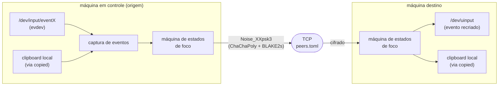
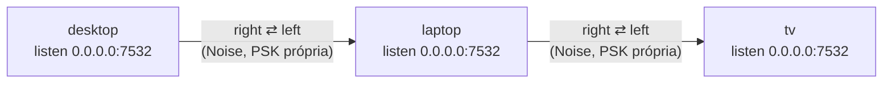

<p align="center">
  <a href="README.md">🇧🇷 Português</a> ·
  <a href="README.en.md">🇺🇸 English</a>
</p>

# kvmc-share

Compartilhamento de mouse/teclado/clipboard entre uma malha de máquinas
Linux, feito especificamente porque o COSMIC (compositor do Pop!_OS) ainda
não implementa o portal `org.freedesktop.portal.InputCapture` do Wayland — o
que faz o Barrier, o Input Leap e o Deskflow não funcionarem nele (veja as
issues [pop-os/xdg-desktop-portal-cosmic#217](https://github.com/pop-os/xdg-desktop-portal-cosmic/issues/217)
e [pop-os/cosmic-comp#980](https://github.com/pop-os/cosmic-comp/issues/980)).

## Como funciona

Em vez de depender de qualquer protocolo do Wayland (portal, wlroots
layer-shell, etc.), este projeto atua uma camada abaixo, direto no kernel: lê
eventos brutos de `/dev/input/eventX` via `evdev` na máquina de origem e os
recria via `/dev/uinput` na máquina de destino. Isso funciona independente do
compositor.

Um único binário, `kvmc-share`, roda em cada máquina da malha. Cada instância:

1. Abre seus dispositivos locais e cria seu dispositivo virtual `uinput` no
   boot — qualquer máquina pode virar origem ou destino de controle a
   qualquer momento.
2. Mantém uma conexão TCP persistente e autenticada (Noise Protocol) com cada
   peer declarado em `peers.toml` (só os vizinhos imediatos — não é preciso
   um mapa global de telas).
3. Roteia eventos de input/clipboard através de uma máquina de estados de
   foco: quando o cursor cruza a borda configurada (ou você aperta **Scroll
   Lock**), a captura passa pro vizinho daquela direção; se o cursor
   injetado nele cruzar outra borda, o controle é repassado adiante — um
   relay em cadeia, sem servidor central.

Não existe hub/coordenador: cada máquina só sabe do vizinho imediato em cada
direção (`left`/`right`/`up`/`down`).

### Fluxo de dados dentro de uma máquina



### Topologia da malha (exemplo de 3 máquinas)

Cada máquina só conhece o vizinho imediato — sem servidor central. Cruzar a
borda direita de `laptop` indo pra `tv` funciona mesmo sem `desktop` saber
que `tv` existe (relay em cadeia):



## Requisitos

- Rust (`cargo`) instalado, ou compile numa máquina e copie o binário
  `--release` pras outras (mesma arquitetura).
- Seu usuário precisa conseguir **ler** os dispositivos em `/dev/input/` e
  **escrever** em `/dev/uinput`. Veja a seção de permissões abaixo.
- [`copied`](https://github.com/marsc98/copied) rodando em cada máquina, se
  quiser sync de clipboard (opcional — o KVM funciona normalmente sem ele,
  só sem sincronizar a área de transferência).

## Setup rápido (`scripts/setup.sh`)

O jeito mais fácil de preparar uma máquina é o assistente:

```bash
./scripts/setup.sh
```

Ele guia, em ordem, por todas as etapas manuais descritas abaixo: permissões
(grupo `input`, regra udev de `/dev/uinput`), compilação/localização do
binário, escolha dos dispositivos de captura, geração do `peers.toml`, e
troca das PSKs com os vizinhos. É idempotente — rodar de novo detecta o que
já está feito.

Cada etapa também é um subcomando avulso:

| Subcomando | O que faz |
| --- | --- |
| `deps` | grupo `input`, regra udev de `/dev/uinput`, binário |
| `config` | dispositivos de captura (`KVMC_SHARE_DEVICES`) + `peers.toml` |
| `keygen` | PSK por par de peers (gera/recebe, distribui via `scp`) |
| `run` | sobe o daemon em foreground (lê `~/.config/kvmc-share/env`) |
| `service` | instala unit `systemd --user` + `enable-linger` |
| `doctor` | diagnostica o que está e o que não está pronto |
| `uninstall` | remove unit, regra udev e `~/.config/kvmc-share` |

`KVMC_BIN=/caminho/do/kvmc-share ./scripts/setup.sh` aponta para um binário
pré-compilado (útil na máquina sem `cargo`).

Não sabe se está tudo certo? `./scripts/setup.sh doctor`.

## Compilando

```bash
cargo build --release
# gera target/release/kvmc-share
```

## Descobrindo os paths dos dispositivos

```bash
# lista nome + arquivo event de cada dispositivo
cat /proc/bus/input/devices | grep -E "Name|Handlers"

# ou, mais estável entre reboots (recomendado usar estes paths):
ls -l /dev/input/by-id/
```

Procure algo como `usb-SEU_TECLADO-event-kbd` e `usb-SEU_MOUSE-event-mouse`.

## Permissões

**Leitura de `/dev/input/eventX`**: normalmente já liberado pro grupo
`input`. Confira se seu usuário está nele:

```bash
groups $USER   # deve listar "input"; se não, rode:
sudo usermod -aG input $USER
# depois faça logout/login (ou reboot) pra valer
```

**Escrita em `/dev/uinput`**: geralmente é restrito a root por padrão. Crie
uma regra de udev pra liberar pro seu grupo:

```bash
echo 'KERNEL=="uinput", GROUP="input", MODE="0660"' | \
  sudo tee /etc/udev/rules.d/99-kvmc-share-uinput.rules
sudo udevadm control --reload-rules
sudo udevadm trigger
```

Se preferir não mexer em regras de udev, rodar o binário com `sudo` resolve
rapidamente (menos elegante, mas funciona pra testar).

## Pareamento (`keygen`)

Cada par de peers precisa de uma PSK (chave pré-compartilhada de 32 bytes)
gerada uma vez. Na máquina `desktop`, pra parear com `laptop`:

```bash
./target/release/kvmc-share keygen laptop 192.168.1.50
```

Isso gera `~/.config/kvmc-share/peers/laptop.psk` (permissão `0600`) e tenta
`scp` esse arquivo pro mesmo path relativo em `192.168.1.50` automaticamente
(requer SSH configurado — pode passar `usuario@host` em vez de só o IP se
necessário). Se o `scp` falhar (sem SSH configurado, chave não aceita, etc.),
o comando imprime o path do arquivo local e a instrução de cópia manual —
basta copiar o mesmo arquivo pro mesmo path na outra máquina por qualquer
meio (pendrive, `rsync`, etc.). Se já existir uma PSK pra esse peer, o
comando pede confirmação antes de sobrescrever.

Repita o `keygen` do outro lado (rodando em `laptop`, apontando pra
`desktop`) — cada máquina só precisa ter a **mesma PSK** salva localmente
pro par em questão; o `scp` automático já cobre isso se der certo numa única
direção, então normalmente um `keygen` por par já é suficiente.

## Configuração (`peers.toml`)

Crie `~/.config/kvmc-share/peers.toml` em cada máquina:

```toml
[local]
name = "desktop"
width = 2560
height = 1440
listen = "0.0.0.0:7532"

[[peer]]
name = "laptop"
addr = "192.168.1.50:7532"
psk_path = "~/.config/kvmc-share/peers/laptop.psk"
direction = "right"
```

- `name`: identificador único desta máquina na malha (usado no handshake e
  no desempate de corrida de foco — vence o nome lexicograficamente menor).
- `width`/`height`: resolução usada pra decidir quando o cursor cruzou a
  borda da tela.
- `[[peer]]`: um bloco por vizinho imediato. `direction` é a borda por onde
  o controle passa pra esse peer (`left`/`right`/`up`/`down`).

Exemplo de malha de 3 máquinas (`desktop` — `laptop` — `tv`, da esquerda pra
direita): `desktop` declara só `laptop` como peer `right`; `laptop` declara
`desktop` como `left` e `tv` como `right`; `tv` declara só `laptop` como
`left`. Cruzar a borda direita de `laptop` indo pra `tv` funciona mesmo sem
`desktop` saber que `tv` existe — o relay em cadeia cuida disso.

**Dispositivos de captura locais**: `peers.toml` ainda não tem um campo pra
isso — declare via variável de ambiente antes de rodar (limitação conhecida,
ver abaixo):

```bash
export KVMC_SHARE_DEVICES=/dev/input/by-id/usb-SEU_TECLADO-event-kbd:/dev/input/by-id/usb-SEU_MOUSE-event-mouse
```

## Gestão de peers no dia a dia

Depois do setup inicial, edite a malha sem mexer no `peers.toml` na mão:

| Subcomando | O que faz |
| --- | --- |
| `peer list` | lista os peers cadastrados (nome, addr, direction) |
| `peer add <nome> --addr <ip:porta> --direction <left\|right\|up\|down> [--psk-path <caminho>]` | cadastra um peer novo; `psk_path` é derivado por convenção (rode `keygen` em seguida) |
| `peer edit <nome> [--addr ...] [--direction ...]` | sem flags, mostra os valores atuais; com flags, atualiza só os campos passados |
| `peer rm <nome>` | remove a entrada e apaga a PSK correspondente (pede confirmação) |
| `local edit [--name ...] [--width ...] [--height ...] [--listen ...]` | mesmo padrão de `peer edit`, mas para a seção `[local]` |

Nenhum desses comandos reinicia um daemon já rodando — eles só escrevem no
`peers.toml` e avisam que é preciso `systemctl --user restart kvmc-share`
(ou reiniciar o `run` manual) pra aplicar.

## Rodando

Em cada máquina da malha:

```bash
./target/release/kvmc-share run
```

Não importa a ordem — cada instância escuta em `local.listen` e tenta
conectar nos peers com nome lexicograficamente maior que o seu (evita duas
pontas discando uma pra outra ao mesmo tempo).

Pra restringir a sessão a um subconjunto dos peers já cadastrados (ex.: só
`laptop` e `tv`, mesmo tendo outros na malha), use `--to`:

```bash
./target/release/kvmc-share run --to laptop,tv
```

Mova o cursor até a borda configurada, ou pressione **Scroll Lock**, pra
alternar o controle manualmente a qualquer momento.

## Segurança

O tráfego entre peers é autenticado e cifrado com
[Noise Protocol](http://noiseprotocol.org/) (`Noise_XXpsk3_25519_ChaChaPoly_BLAKE2s`),
usando a PSK gerada pelo `keygen` como segredo compartilhado — isto já não é
mais "rode em VPN por sua conta e risco": sem a PSK certa, o handshake falha
e nenhum dado é aceito. Ainda assim:

- Guarde os arquivos `.psk` (`~/.config/kvmc-share/peers/*.psk`) com cuidado —
  quem tiver a PSK de um peer pode se passar por ele.
- O nome do peer viaja em texto claro antes do handshake (necessário pro
  respondedor escolher a PSK certa entre vários peers na mesma porta) — não é
  segredo, só identifica quem está discando.
- Evite expor a porta configurada em `listen` diretamente na internet; uma
  VPN mesh (Tailscale/WireGuard) continua sendo uma camada extra razoável.

## Limitações remanescentes

- **Dispositivos de captura via variável de ambiente** (`KVMC_SHARE_DEVICES`),
  não em `peers.toml` — pendente de uma versão futura de `config.rs`.
- **Clipboard sync depende do [`copied`](https://github.com/marsc98/copied)
  rodando localmente** (socket `$XDG_RUNTIME_DIR/copied.sock`); sem ele, o
  KVM funciona normalmente, só sem sincronizar a área de transferência.
  Escrita de imagem no clipboard local ainda não é suportada pelo `copied`
  (só leitura).
- Layout de teclado: como encaminhamos o *scancode* bruto (não o caractere já
  traduzido), quem decide o layout final é a configuração de teclado da
  máquina de **destino** — funciona bem se as máquinas usam o mesmo layout.
- Validação end-to-end em hardware real (múltiplas máquinas, malha com
  relay em cadeia, `tcpdump` confirmando ausência de texto claro) ainda
  pendente — ver checklist de verificação manual no processo de
  desenvolvimento deste projeto.

## Licença

[PolyForm Noncommercial 1.0.0](LICENSE) — uso pessoal, educacional e não-comercial livre. Ver `LICENSE` pra termos completos.
